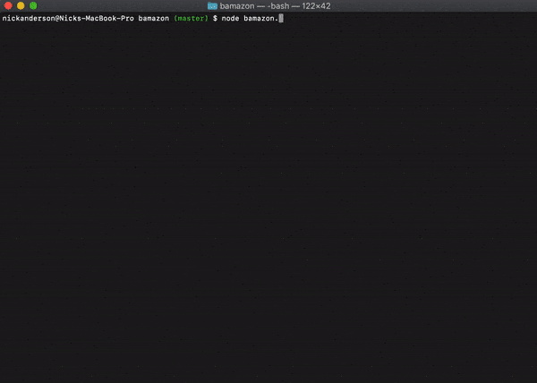
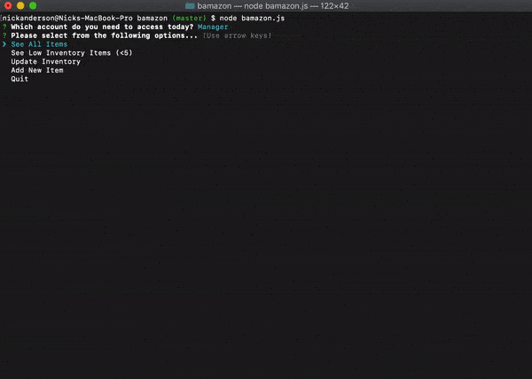

# Bamazon

Using mysql npm package, this project sets up a simple CLI app to view, purchase, and update inventory. Initially, the user is prompted to select between a customer and a manager view. A customer is able to view the products available for sale and submit orders. Both the quantity and item ID are validated and the app will not proceed with invalid input for either case. A manager is able to view low invnetory (items with less than 5 units remaining), update inventory quantities for exisiting items, and insert new items for sale. Below are a couple of GIFs demonstrating the work flow.

### Instruction to use

- Download or Clone repo here: https://github.com/nkanderson86/bamazon
- Run npm install to grab the inquirer and mysql packages
- Make sure you have a SQL database and include your credentials in a .env folder to authenticate
- Copy bamazon.sql file into your SQL client and run queries to create db, create table, and insert data into table.
- From your terminal run "node bamazon.js" to start the app

### Technology used

- npm packages (mysql, inquirer)
- javascript promises along with the asych/await feature on functions
- SQL database to store inventory values

### Bamazon Customer

### Bamazon Manager

### mysql made easy

With an assist from Emile, I was able to implement a streamlined way to call and use the mysql npm package. Checkout query.js! The most important part here is that the function returns a promise, which then allows for using the asynch/await syntax on my functions in bamazonMgr.js and bamazonCust2.js. The option to wait on my SQL queries to complete and return results before moving forward made development on this project much easier.

### Roadmap

- Add database & table creation code
- Add supervisor view
- make both the customer and manager view loop back to the main menu
